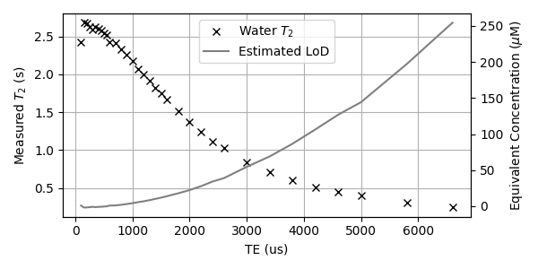
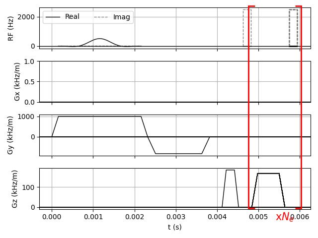
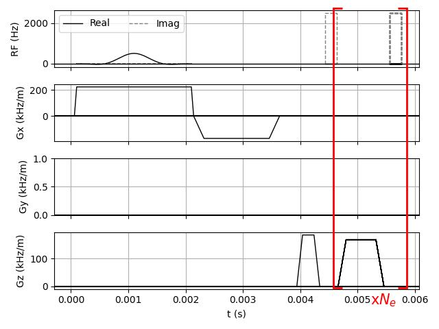
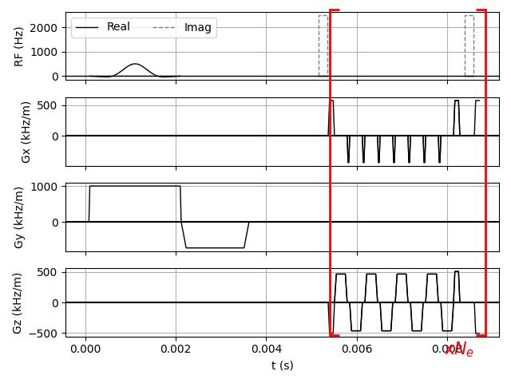
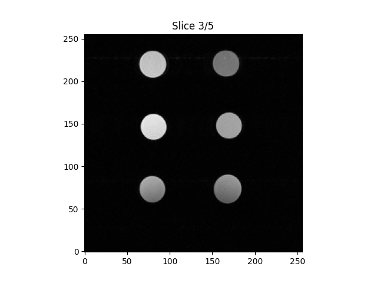

# TSER
Turbo Spin Echo Relaxometry for Multi-Well Plates

## Background
MRI imaging sequences typically do not support the fast echo times required for high sensitivity CPMG $T_2$ measurements. This figure shows the relationship between the measured $T_2$ and echo time in a benchtop magnet, along with the equivalent iron limit of detection from [1]:

The 7T scanners have significantly better homogeneity, which will reduce the dependence on diffusion and improve the LoD for a given echo time. This document describes several approaches that trade image quality for fast echo times. The first three are Multi-Spin-Multi-Echo sequences, the last is mostly a note to try SWI before we go too far reinventing the wheel. 

### Scanner and Imaging Constraints
The achievable echo times for a given set of imaging constraints depend on the capabilities of the scanner and console. The most relevant parameters are the maximum RF amplitude, gradient slew rates, and maximum gradient amplitudes. The python scripts that generate the sequences below all define these parameters in the System object. In every case, the shortest possible TE should be used.

### Slice Thickness Considerations
Two of these sequences allow for slices to be taken through the well (by convention, in the y direction). Because there is no constraint on diffusion through these slices, thinner slices will produce shorter $T_2$ times and have a correspondingly higher LoD for iron measurements, etc. It is recommended to use slices that are at least 2mm thick. 

## Single Column, Optional Well Depth Slices: cpmg_1d.py
This sequence assumes only a single row of wells is filled, and that that row is aligned in the z direction. There is no phase encoding: on each echo, there is a single readout gradient with exactly as many points as there are wells. The refocusing pulses eliminate any need for prewinders or rewinders after the first echo, and the readout gradient polarity is always the same. The refocusing pulses are not slice selective.

The section in red brackets is repeated for every echo. In order to leave room for the slice selection pulse and rephasing lobe, the first refocusing pulse has a longer delay, and the CPMG sequence begins TE/2 after the first spin echo. There is one prewinder before the beginning of the CPMG stage.

### Parameters
- FOV = 9mm * (number of wells, probably 12)
- Resolution: 9mm
- RO gradient area: 1/9mm
- RO gradient duration: TE-T_Refocus (allowing time for gradient slewing)
- ADC: One point per well per readout gradient
- Larmor frequency and gradient center point calibration is important

### Reconstruction
- One 1D image per echo from 1D ifft. Each pixel is one well. Get $T_2$ from exponential fit for each pixel.

## Full Plate, Frequency Encoding Only: cpmg_1d_multislice.py
This is very similar to msme_1d, but slice selection is used to select a column of wells instead of a slice through the wells. With $N$ TRs, $N$ columns are scanned in the same well plate. No relaxation delay is necessary between TRs assuming good refocusing pulses.

### Parameters
Same as for cpmg_1d. 

### Reconstruction
- One 1D image per echo per TR from 1D ifft. TRs for other columns can be stacked. Each pixel is one well. Get $T_2$ from exponential fit for each pixel.

## Full Plate Echo-Planar, Optional Well Depth Slices: cpmg_epi.py
This sequence may not be feasible for TE shorter than ~10ms. This sequence attempts a full echo-planar image on each echo, allowing for 3D $T_2$ measurement.

### Parameters
- FOV = size of well plate. Different for z and x.
- Resolution: 9mm
- RO gradient area: 1/9mm
- RO gradient duration: ~(TE-T_Refocus) / number of columns
- ADC: One point per well per readout gradient, 96 per echo
- Larmor frequency and gradient center point calibration is important

### Reconstruction
- One 2D image per echo from 2D ifft. Get $T_2$ from exponential fit for each pixel.

## GRE/SWI
We should check the sensitivity of $T_2^{\*}$ imaging for low iron concentrations. Imaging with phase might be difficult because of the air/plastic/water boundaries in the well plate. We should try GRE with varying delays between excitation and the prewinder. It's probably better to avoid spoiling so that it doesn't effect the measured $T_2^*$.

This GRE image shows more contrast from the receive coil sensitivity than it does from differences in $T_2^*$. This needs to be calibrated out. The KI 7T system doesn't give us the phase image by default, we need to figure out how to get that out before recon to be able to try SWI approaches. 

# References

[1] Yang, Y.; Tan, K. Z. N.; Kang, M.; Chen, M.; Cui, L.; Lim, F. W. I.; Chen, Y.; Kwek Zeming, K.; Han, J. Rapid Determina-tion of Iron in Serum and Plasma Using Micromagnetic Reso-nance Relaxometry (μMRR). Anal. Chem. 2025. https://doi.org/10.1021/acs.analchem.4c05735.
